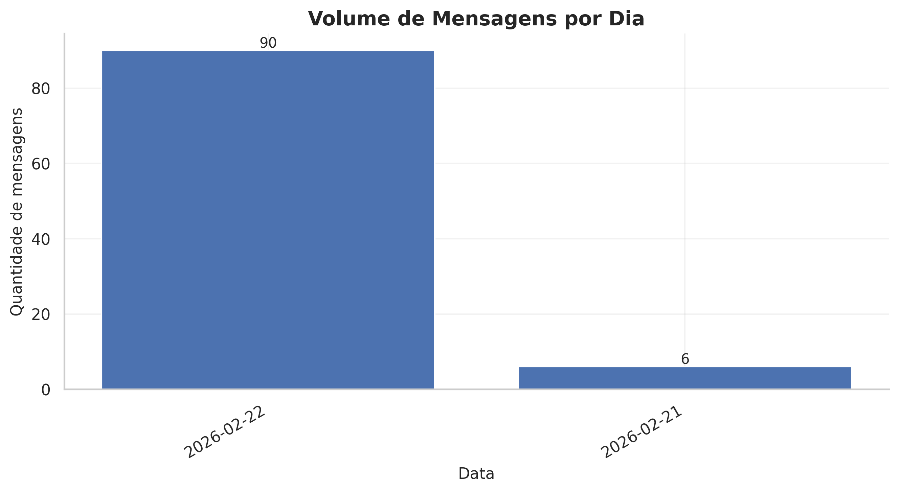
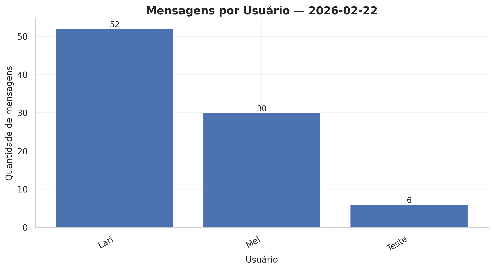
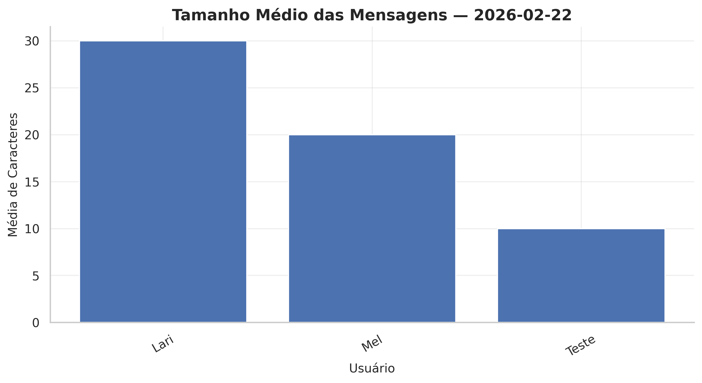
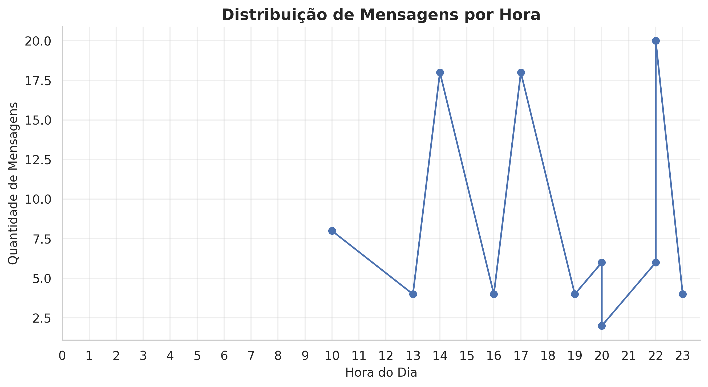
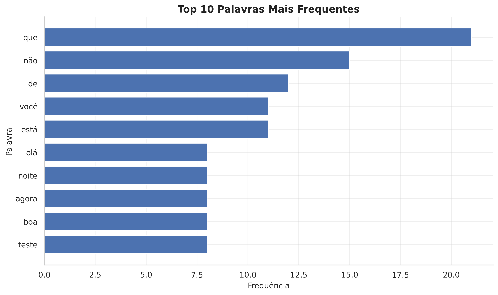

# 🚀 Telegram Data Pipeline on AWS

End-to-end serverless data pipeline built on AWS to ingest, transform and analyze Telegram group messages using a layered Data Lake architecture.

---

## 🏗 Architecture Overview

**Flow:**

Telegram  
→ API Gateway  
→ Lambda (Ingestion)  
→ S3 RAW Layer (JSON, partitioned by date)  

EventBridge (Daily Schedule)  
→ Lambda (ETL Transformation)  
→ S3 ENRICHED Layer (Parquet, partitioned)  

Amazon Athena  
→ Analytical Queries (SQL)

---

## 🗂 Data Lake Layers

### 🔹 RAW Layer
- Stores original Telegram JSON payload
- Partitioned by `context_date`
- Immutable raw storage for traceability
- Optimized for durability, not performance

Example structure:

```
s3://raw-bucket/telegram/context_date=YYYY-MM-DD/
```

---

### 🔹 ENRICHED Layer
- Processed data in Parquet format
- Columnar storage for analytical performance
- Partitioned by `context_date`
- Queried using Amazon Athena

Example structure:

```
s3://enriched-bucket/telegram/context_date=YYYY-MM-DD/
```

---

## 🧠 Engineering Concepts Applied

- Serverless architecture
- Data Lake layered design (RAW / ENRICHED)
- Separation of ingestion and transformation responsibilities
- Partitioning strategy for performance optimization
- Columnar storage (Parquet)
- Scheduled ETL with EventBridge
- Analytical querying with Athena

---

## 📊 Analytical Results

After processing and structuring the Telegram data lake, analytical queries were executed in Amazon Athena to extract behavioral insights from the group activity.

---

### 📈 Message Volume per Day



This metric shows daily activity distribution and highlights peak engagement days.

---

### 👤 Messages per User



User participation distribution helps identify the most active contributors.

---

### 🧠 Average Message Length



This metric reveals communication patterns and message depth per user.

---

### ⏰ Temporal Activity Distribution



Hourly and weekday analysis shows engagement peaks across time periods.

---

### 🔤 Word Frequency Analysis



Basic NLP preprocessing was applied to identify the most frequent words used in the group.
## 👩‍💻 Author

Developed as part of a professional transition into Data Engineering, applying real-world AWS architecture patterns and serverless design principles.
## 💼 Business Value

This project demonstrates the implementation of a scalable serverless data pipeline capable of:

- Collecting real-time event data
- Structuring raw event payloads into optimized analytical datasets
- Applying partitioning strategies for performance optimization
- Enabling SQL-based exploratory and behavioral analysis
- Supporting downstream BI and dashboard integrations

The architecture reflects real-world cloud data engineering patterns commonly used in production environments.
